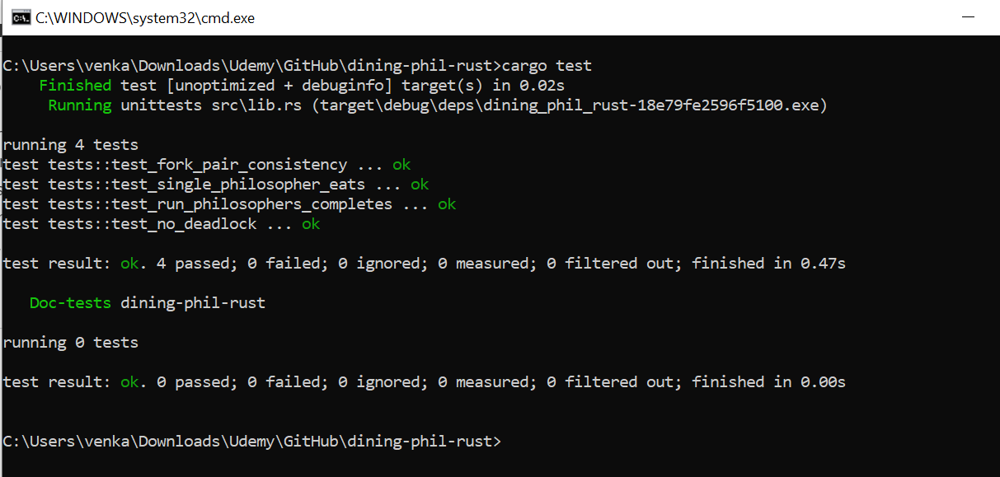

# 🥢 Dining Philosophers Problem in Rust

This project implements the classic **Dining Philosophers Problem** in safe, idiomatic Rust using threads, `Arc`, and `Mutex`. It simulates philosophers thinking and eating with shared forks, preventing deadlocks via ordered locking.

## 🚀 Features

- Thread-safe `ForkPool` managing shared forks
- Deadlock-free fork acquisition logic (even/odd ordering)
- Configurable eating cycles per philosopher
- Modular and testable architecture
- Deadlock detection test with timeout

## 📦 How It Works

Each philosopher is modeled as a thread.

- Forks are shared via `Arc<Mutex<T>>`
- Philosophers alternate between thinking and eating
- To prevent deadlock:
  - Even philosophers lock left → right
  - Odd philosophers lock right → left

## 📁 Project Structure

```text
src/
├── lib.rs         # All logic and testable code
```

## ✅ Example: Run Simulation

You can run the simulation by calling:

```rust
run_philosophers(); // 5 philosophers, 3 eating cycles each
```

## 🧪 Unit Tests

This project includes a comprehensive test suite under `#[cfg(test)]`.

### Included Tests

✅ **Fork Pair Consistency**

  - Ensures left/right forks are never the same

✅ **Run Completes**

  - Runs all philosophers and checks for thread errors

✅ **Single Philosopher**

  - Verifies one thread can acquire forks and eat

✅ **Deadlock Detection**

  - Simulates runtime and checks for timeout failure

### Run All Tests

```bash
cargo test
```

## ✅ Unit Tests in Action



## 🛡️ Safety & Concurrency

- No unsafe code
- Uses `Arc<Mutex<T>>` safely
- Tests include deadlock timeout check

## 📚 Learning Outcomes

This project helps you practice:

- Learning Rust concurrency
- Safe multithreading with `Arc` and `Mutex`
- Deadlock-free resource coordination
- Writing concurrent tests in Rust
- Structuring clean, idiomatic Rust libraries

## 📜 License

MIT License © 2025 VG
